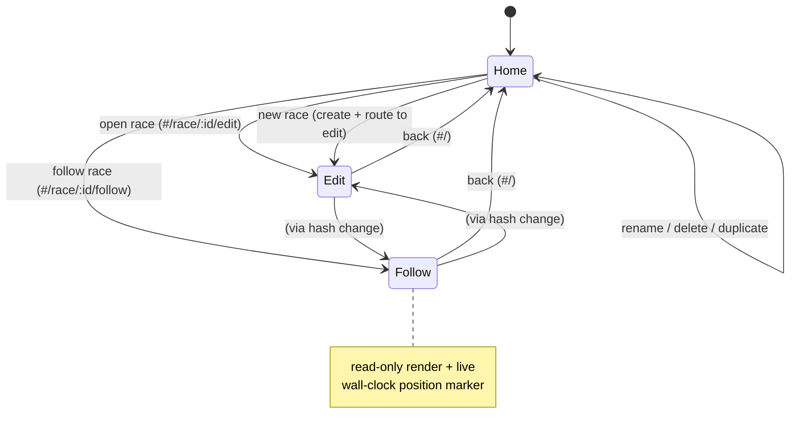
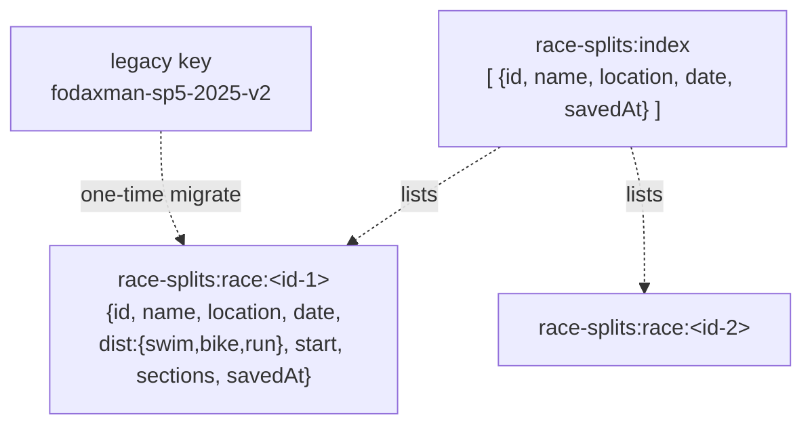

# Multi-Race Splits App - Plan

## Goal Capsule

- **Objective:** Turn the single hardcoded-race splits tool into a multi-race app with three views — a home list of saved races, the existing edit view (per race), and a read-only follow view with a live position marker.
- **Authority hierarchy:** This plan → the existing `index.html` conventions (single self-contained file, vanilla JS IIFE, localStorage) → repo `README.md`. Where this plan and existing code conflict on behavior, existing edit-mode behavior wins (it must be preserved verbatim); where they conflict on structure, this plan wins (structure is what changes).
- **Stop conditions:** Stop and surface a blocker if preserving current edit behavior forces a data-model change not described here, or if the read-only render cannot reuse the existing render without a full rewrite (see U5 Approach for the intended path).
- **Execution profile:** Single-file front-end, no build step, no framework, no automated test harness. Verification is manual in-browser (see Verification Contract).
- **Tail ownership:** Implementer runs the manual verification flow and confirms the legacy race migrated non-destructively before declaring done.

---

## Product Contract

### Summary

Restructure the app into a multi-race client kept in the **same single `index.html`** (zero build, offline, portable). Add hash-based routing for three views: a home list of races read from localStorage, the current edit screen scoped to one race, and a read-only follow screen whose timeline carries a live wall-clock position marker. Storage moves from today's one fixed key to a keyed multi-race collection; the existing saved race migrates in on first load. Masthead fields that are hardcoded HTML today (name, location, date, leg distances) become per-race data.

### Problem Frame

Today `index.html` is a single-race tool: the race ("Fodaxman Solo Point Five 2025") is hardcoded in the masthead markup and in the `RACE()` seed, and its state lives under one fixed localStorage key (`fodaxman-sp5-2025-v2`). The whole app is effectively the edit view. There is no way to keep more than one race, no landing surface to pick between them, and no spectator-facing "where is the athlete right now" view — the last is already named as intended future work in the file's own footer ("a live 'where is he now' marker for the staff view"). Supporting several races and a race-day follow mode requires a storage model that holds many races, a way to navigate between them, and a read-only rendering of an existing race.

### Requirements

**Home / library & navigation**

- R1. The home view lists every saved race with its name, location, date, and finish/total time.
- R2. A "New race" action on the home view creates an empty race and opens it in edit mode.
- R3. Each listed race can be opened in edit mode or follow mode.
- R4. Races can be renamed and deleted from the home view; duplicate is optional (see Scope Boundaries).
- R5. The three views are addressed by URL hash (`#/`, `#/race/:id/edit`, `#/race/:id/follow`) so they are bookmarkable within the browser and support back-navigation; an unknown or missing hash resolves to home.

**Edit mode**

- R6. Edit mode preserves all current behavior: split-edit simulation, elapsed/clock absorb rule, drag-to-reorder, paste/import, backup/restore JSON, map links, copy-as-table, undo, per-browser autosave, and the storage-blocked warning.
- R7. Race header fields (name, location, date, and the three leg distances) are per-race and editable inside the app; the importer's even-split distance estimate uses the race's own leg distances rather than global constants.

**Follow mode**

- R8. Follow mode is a read-only render of the edit view: no editable inputs, no drag handles, no add/remove/import/reset controls, no gun-time editing.
- R9. The follow timeline shows a live position marker computed from the real current time against the race's gun time and splits — it sits at the start before the gun, advances through the segments as real time passes, and rests at the finish afterward. It respects `prefers-reduced-motion`.

**Data & migration**

- R10. localStorage holds multiple races keyed by a stable per-race id; each edit persists only the active race (plus the lightweight index).
- R11. The existing single saved race migrates non-destructively into the multi-race store the first time the new build loads.

### Scope Boundaries

**Outside this product's identity**

- Server sync or cross-device storage — the app is deliberately localStorage-only ("It does not follow you to another device"). Backup/restore JSON stays the transfer mechanism.
- Authentication, accounts, or sharing races between users.

**Deferred for later** (named in the file's roadmap, not this plan)

- Elevation per checkpoint and cut-off times.
- A projected/target-pace overlay in follow mode (the marker shows *position*, not projections).

#### Deferred to Follow-Up Work

- Race **duplicate** from the home list — include if cheap during U3 (the home list is built there; U4 never touches the list); otherwise defer.
- Caching finish/total in the index for the list instead of loading each race blob to compute it (only matters at many races).

---

## Planning Contract

### Key Technical Decisions

- KTD1. **Stay a single self-contained `index.html` with a hash router.** No build step, no file split, no framework — this preserves the offline/portable/paste-to-run nature the tool is built around. A minimal router parses `location.hash`, maps it to a view, and re-mounts on `hashchange`. Alternative (multi-file + bundler) rejected: it breaks the zero-dependency shipping model for no user-facing gain.
- KTD2. **Storage layout: one index key + one blob per race.** `race-splits:index` holds an array of light entries (`{id, name, location, date, savedAt}`); each race is stored under `race-splits:race:<id>`. Editing rewrites only the active race blob and the index, not the whole library. Rejected alternative: a single monolithic library key — simpler but rewrites every race on each keystroke and bloats one value.
- KTD3. **The edit view becomes a race-scoped mount.** The module-level `state` singleton and its direct `save()`/`load()` on the fixed key are replaced by a mount function that loads a race by id, holds it as the active context, and persists through the storage layer. `undoStack`, `selected`, and drag state reset per mount. This is the heaviest change and touches most of sections 1, 4, 5, and 8 of the current script.
- KTD4. **Follow mode reuses the edit render behind a `readOnly` flag** rather than a parallel render path. Field builders (`textField`, `timeField`, `distField`) and row/board builders take a read-only mode that emits static text instead of `<input>` and omits grip/act controls. This keeps the two views from drifting. If threading the flag proves invasive, fall back to a dedicated read-only render that reuses the derived helpers (`cumulative`, `paceOf`, `groups`, formatters) — those stay shared regardless.
- KTD5. **The live marker is wall-clock driven with an interval tick.** `race.start` is stored only as seconds-of-day (no date), so before-gun and after-finish occupy the same clock region once day-wrapped and a single subtraction cannot tell them apart. Use piecewise logic instead of one formula: let `d = ((nowClockSeconds - race.start) % 86400 + 86400) % 86400`. If `d <= total` → mid-race, marker at `d / total`. Otherwise disambiguate by nearest boundary: if `(86400 - d) < (d - total)` → not-started (marker 0); else finished (marker at `total`). This nearest-boundary convention is the intended behavior given no race date is stored. When `total === 0` (splitless race) suppress the marker entirely (see U5 empty state). A timer (1 s cadence, cleared on unmount and skipped under reduced motion → single static paint) recomputes the marker. The marker overlays the existing `.bar` using the same proportional geometry the segments already use; it is `aria-hidden` with position exposed via a separate polite aria-live status (F14).
- KTD6. **Per-race leg distances move into the race object.** Today `SPORTS[sport].official` holds the 2000/87000/22000 defaults consumed by `buildSections`. The race gains `dist: {swim, bike, run}`, seeded from those defaults for new races via the per-sport form `{swim: SPORTS.swim.official, bike: SPORTS.bike.official, run: SPORTS.run.official}`; `buildSections` and any distance-estimate logic read the active race's distances. `SPORTS` is keyed by sport, so always use `SPORTS[sport].official` — never the bare `SPORTS.official` (undefined). The per-sport `SPORTS[sport].official` remains the default seed only.

### High-Level Technical Design

Route/view state machine:

Storage / data model:

The section (checkpoint) shape inside `sections` is unchanged from today (`{id, name, sport, dist, dur, est, note, map}`); the race object wraps it with identity and metadata.

### Assumptions

- The app has no automated test harness and none is being added (would be scope creep). "Test scenarios" below are concrete behavioral checks run in a browser; Verification Contract names the manual flow.
- Races are few (single digits to low tens) per browser, so loading every race blob to render the home list is acceptable; index-cached finish time is a deferred optimization.
- Legacy migration runs at most once, gated on a persistent sentinel key (`race-splits:migrated = "1"`), not on "index empty + legacy exists". An empty index is not a durable once-only signal: R4/U3 let the user delete every race back to an empty index, and the empty-index trigger would then re-import the (still-present, non-destructive) legacy key and resurrect the deleted sample race. The legacy key is left in place; the sentinel is what prevents re-import.

### Sequencing

U1 → U2 → (U3, U4, U5). U2 depends on U1's storage layer. U3, U4, U5 each depend on U2's router + mounted edit view. U5 reuses the edit render made mountable in U2 and the `readOnly` flag decided in KTD4. U4 (race metadata) and U5 (follow) are independent of each other.

---

## Implementation Units

### U1. Multi-race storage layer + migration

- **Goal:** Introduce the keyed multi-race store and migrate the existing single race, with no UI or routing yet.
- **Requirements:** R10, R11.
- **Dependencies:** none.
- **Files:** `index.html` (script section 1 — model/storage).
- **Approach:** Add `INDEX_KEY = "race-splits:index"`, `raceKey(id) = "race-splits:race:" + id`, and a migration sentinel `MIGRATED_KEY = "race-splits:migrated"`. Write storage functions: `listRaces()` (read index), `loadRace(id)`, `saveRace(race)` (requires/assigns a race `id` — never key on `undefined`; writes blob + upserts index entry + stamps `savedAt`), `createRace(fields)` (new id via existing `uid()`, `dist` defaults from the per-sport form `{swim: SPORTS.swim.official, bike: SPORTS.bike.official, run: SPORTS.run.official}`), `renameRace(id, name)`, `deleteRace(id)`. **`createRace` seeds exactly one placeholder checkpoint** (mirror `removeSection`'s fallback `sec("", "swim", null, 0)` — `index.html:629`) rather than `sections: []`, because `normalize()` returns null for an empty sections array (`index.html:351` and `:364`); a `sections: []` blob would make `loadRace` return null and the New-race mount render nothing. Extend `normalize()` to validate/carry race identity + metadata (`id`, `name`, `location`, `date`, `dist`) while keeping its empty-sections guard intact for backup/import validation. Add `migrateLegacy()`: gated on the sentinel — if `MIGRATED_KEY` is unset and a legacy blob exists under `KEY`/`OLD_KEYS`, build a race (name "Fodaxman Solo Point Five 2025", location "Serra do Rio do Rastro, SC", date "2025-09-27", dist {swim:2000, bike:87000, run:22000}, existing `start`+`sections`), save it, then set `MIGRATED_KEY = "1"`; leave the legacy key untouched. The sentinel (not an empty index) is what makes migration run at most once, so a later all-races-deleted state does not re-import (see Assumptions, F4). Preserve the `storageOK`/blocked-storage handling.
- **Patterns to follow:** existing `normalize()`, `load()`, `save()`, `storageGet()`, `uid()`, `RACE()` seed.
- **Test scenarios:**
  - Fresh browser (no keys): `listRaces()` returns empty; `createRace({name:"X"})` yields a race with a unique id, one placeholder checkpoint, and default distances; it survives `normalize()` (i.e. `loadRace` returns it, not null) and appears in the index.
  - Legacy present (a `fodaxman-sp5-2025-v2` blob, sentinel unset): after `migrateLegacy()`, exactly one race exists with the correct name/location/date/distances and the migrated start + sections; the legacy key still exists (non-destructive) and `race-splits:migrated` is now `"1"`.
  - Covers R11. Migration runs at most once — re-running is a no-op whether the index is populated **or** empty; deleting the migrated race then reloading does not resurrect it (sentinel gate, not empty-index).
  - `saveRace` then `loadRace` round-trips all fields including notes and map links; `deleteRace` removes both the blob and the index entry.
  - Malformed blob (bad JSON / missing sections) returns null from `loadRace` without throwing.
- **Verification:** In DevTools console, exercise the storage functions and inspect `localStorage`; confirm index and per-race keys match the model in HTD.

### U2. Hash router + edit view as a race-scoped mount

- **Goal:** Add routing and convert the current app into an edit view that mounts against one race id loaded from the storage layer.
- **Requirements:** R5, R6 (behavior preserved), R10 (persist active race).
- **Dependencies:** U1.
- **Files:** `index.html` (new `#app` container + router; script sections 1, 4, 5, 8 rebind from the `state` singleton to a mounted race context).
- **Approach:** Wrap the current masthead/board/legs/dialogs markup in a view container that the router fills. Add `router()`: parse `location.hash` → `{view:"home"|"edit"|"follow", id}`; on `hashchange` unmount the current view and mount the target.
  - **Unresolvable routes (F3):** treat both an unknown/malformed hash **and** a well-formed `#/race/:id/edit|follow` whose `id` is not in the index (deleted race, stale bookmark, tab left open across a delete, hand-edited hash — `loadRace` returns null) the same way: redirect to `#/` and surface a toast ("That race is no longer here"). Never mount a view against a null race.
  - **Active context (F16):** replace module-level `let state = load() || RACE()` with a mount that calls `loadRace(id)` into an active context; route `save()`/`snapshot()`/`undo()`, mutations (section 4), and render (section 5) at that context. Re-query container refs (e.g. `legsEl = $("#legs")` — `index.html:638`) at the **start of each mount**; the module-level once-captured refs point at detached nodes after a re-mount and `render()` paints nothing. Make `render()` read-only-aware for the gun-time element so a follow mount that renders gun time as static text does not hit `.value` on a null `input#start` (see U5).
  - **Listener lifecycle (F6):** the edit view's global handlers — `document` keydown (undo), `window` pagehide, `document` visibilitychange — cannot be container-scoped; they **must** get explicit `removeEventListener` teardown on edit unmount. Without it, repeated home↔edit navigation stacks undo listeners and one Cmd-Z pops several undo steps. (Do not rely on "scope them to the mounted container" for `document`/`window` handlers.)
  - **Reset control (F7):** the existing `#btn-reset` calls `RACE()`, the hardcoded Fodaxman seed, which would overwrite *any* race with Fodaxman data. Do **not** carry it into multi-race verbatim: remove the global "Reset to race" control (its single-race semantics no longer apply). If a reset is wanted, repurpose it to "reset this race to blank" acting on the active race only.
  - **Import/restore identity (F8):** the current import ("Replace splits") and legacy backup-restore assign a fresh `{start, sections}` object to state, dropping `id/name/location/date/dist`. Change these paths to replace **only** `start` + `sections` on the active race, preserving its identity/metadata, then persist through `saveRace` (which keys on the active id). Only a full multi-race backup may carry identity.
  - **Focus & announcement (F11):** each view mount moves focus to the view's top-level heading and updates the document title (or an aria-live region) so keyboard/AT users are not dropped to `body` with no announcement on hashchange.
  - **Watch-live link (F15):** add a "Watch live" link in the edit masthead → `#/race/:id/follow`, mirroring follow's "open in edit" link.
  - Add a "back to races" control. Home may be a minimal stub here (real UI in U3) so the route resolves; follow route may fall back to edit until U5.
- **Patterns to follow:** existing IIFE structure and `$`/`render()` wiring; keep the same DOM ids where markup is reused.
- **Execution note:** This is the highest-risk unit — it restructures a working app. Verify each preserved edit behavior (R6 list) against current `index.html` before moving on; treat any behavior regression as a blocker.
- **Test scenarios:**
  - Loading `#/race/<id>/edit` mounts the edit view for that race; all current behaviors work: split edit pushes later splits; elapsed/clock edit is absorbed by the next split holding the finish; drag reorder clears split+distance; import/paste, backup/restore, map link, copy-as-table, and Cmd/Ctrl-Z undo all behave as before.
  - Editing a field persists to that race's blob (`savedAt` updates; reload restores it) and does not touch other races' blobs.
  - `hashchange` between two race ids swaps the mounted race; undo stack and selection reset per mount (no leakage across races).
  - Unknown hash (e.g. `#/nope`) and empty hash both resolve to home.
  - A well-formed route with a non-existent id (`#/race/deleted-id/edit`, `.../follow`) redirects to `#/` with a toast, not a blank/crashed mount (F3).
  - Repeated home↔edit navigation keeps one undo per Cmd/Ctrl-Z with no listener growth — no stacked keydown-undo handlers (F6).
  - Import ("Replace splits") / legacy restore on a named race replaces its splits but keeps its name/location/date/dist, and it stays keyed in the index (not orphaned) (F8).
  - Browser back after opening a race returns to the previous view.
- **Verification:** Manual in-browser run through the R6 behavior list on a migrated race; compare side by side with the pre-change file.

### U3. Home / race list view

- **Goal:** Build the landing view that lists races and launches them.
- **Requirements:** R1, R2, R3, R4.
- **Dependencies:** U2 (router + mount), U1 (storage).
- **Files:** `index.html` (home markup/render function + styles reusing existing tokens).
- **Approach:** Render `listRaces()` as cards/rows showing name, location, date, and finish/total (compute by loading each race, or via cached total — see deferred). A row with an empty name shows the placeholder **"Untitled race"** (F10) so unnamed races are distinguishable in the list. Per race: Open (→ `#/race/:id/edit`), Follow (→ `#/race/:id/follow`), Rename (inline or dialog → `renameRace`), Delete (with the existing toast+undo pattern → `deleteRace`). A "New race" button calls `createRace` and routes to its edit view. Include race **duplicate** here if cheap (F12: it is a home-list action per R4 and the list is built in this unit, not U4). Empty state when no races exist. Reuse existing `.btn`, `.board`, `.leg`, chip/rule tokens and the `dialog`/`toast` patterns.
- **Patterns to follow:** existing `toast()` undo pattern for deletes; existing dialog markup for rename; `.btn`/`.chip` styling.
- **Test scenarios:**
  - With one migrated race, the list shows its name/location/date and a finish time matching edit mode's finish.
  - "New race" creates and opens a blank race in edit; returning home shows it listed.
  - Open and Follow route to the correct hash and view for the chosen race.
  - Rename updates the list and the race blob; Delete removes it from the list with an undo toast that restores it.
  - Empty state renders when all races are deleted.
- **Verification:** Manual: create, rename, delete, open, follow from the list; confirm hashes and persistence.

### U4. Race metadata: editable header + per-race distances

- **Goal:** Move the hardcoded masthead identity into per-race editable data and make the importer use per-race distances.
- **Requirements:** R7, R1 (list reads these fields).
- **Dependencies:** U2.
- **Files:** `index.html` (masthead render from race data + edit affordances; importer section 7).
- **Approach:** Replace the static `<h1>`/`.where` markup with values rendered from the active race (`name`, `location`, `date`, `dist`). An empty `name` renders the placeholder **"Untitled race"** in the editable masthead `h1` (F10, same placeholder as the home list) until the user types a name. Provide editing — name inline in the masthead, and location/date/leg-distances via a small "race details" dialog (reuse the `dialog` pattern) — persisting through `saveRace`. Update `buildSections()` (and any even-split estimate) to read the active race's `dist` instead of `SPORTS[sport].official`; keep the per-sport `SPORTS[sport].official` as the seed for new races only (never the bare `SPORTS.official`, which is undefined — F5).
- **Patterns to follow:** existing `dialog` (`#mapdlg`) markup/wiring; existing masthead classes.
- **Test scenarios:**
  - Editing name/location/date persists and is reflected in the masthead and the home list.
  - Changing a leg distance then re-importing splits distributes the new distance across that leg's checkpoints (est. distances reflect the edited total).
  - A new race seeds default distances (2000/87000/22000) but they are independently editable per race — editing one race's distances does not affect another's.
  - Covers R7. Distance edits clear the `est` italic flag on manual entry, as today.
- **Verification:** Manual: edit details on two races, confirm independence and importer behavior.

### U5. Follow view — read-only render + live position marker

- **Goal:** Add the read-only follow view with a wall-clock-driven position marker on the timeline.
- **Requirements:** R8, R9.
- **Dependencies:** U2 (mountable render), KTD4 (`readOnly` flag).
- **Files:** `index.html` (render field builders take read-only mode; new marker element + tick; follow mount + styles).
- **Approach:** Mount `#/race/:id/follow` using the same board/legs render as edit but read-only: `textField`/`timeField`/`distField` emit static text instead of inputs; grip handles, act buttons (map/delete), add-checkpoint links, the addbar, and the import/copy/reset/gun-time controls are omitted; the gun-time field renders as static text. Add a marker overlay on `.bar`. **Marker math (KTD5, F1):** let `d = ((nowClockSeconds - race.start) % 86400 + 86400) % 86400`. If `d <= total` → mid-race, position `d / total`, showing current-segment context (name, time into segment). Otherwise disambiguate by nearest boundary: if `(86400 - d) < (d - total)` → not-started (marker 0, "not started" label); else finished (marker at `total`, "finished" label). Do **not** use a single `elapsedNow/total` formula — with `race.start` stored as seconds-of-day only, a day-wrapped negative delta clamps to `total` and paints a false "finished" before the gun.
  - **Empty state (F9):** when `total === 0` (a freshly created / splitless race, reachable via R3), suppress the marker entirely (no `NaN` divide, no console error) and render read-only copy like "This race has no splits yet" — **not** the edit view's empty-bar copy ("No times yet — paste your results or type a split below.", `index.html:653`), which tells spectators to perform edit actions absent in read-only mode.
  - **AT treatment (F14):** the animated marker is `aria-hidden`; expose position through a separate polite `aria-live` status that updates only on **segment change**, not every tick, so screen readers are not spammed by the 1 s cadence.
  - **Gun-time render (F16):** gun time renders as static text with no `input#start`; ensure `render()` is read-only-aware so it does not write `.value` on a null element (re-query/guard per U2).
  - Drive the tick with `setInterval` (1 s), cleared on unmount; under `prefers-reduced-motion` paint once without the interval. Provide a link to open the same race in edit.
- **Patterns to follow:** existing `renderBoard()` proportional segment geometry (`flex-grow`), `.strip`/`.ticks` layout, `cumulative()`/`total()`/`fmt*` helpers, the `@media (prefers-reduced-motion)` block.
- **Execution note:** Prefer threading `readOnly` through the existing render (KTD4) so follow and edit cannot drift; if invasive, use a dedicated read-only render reusing the derived helpers.
- **Test scenarios:**
  - No editable input exists anywhere in follow mode; drag handles, add/remove, import, reset, and gun-time editing are all absent; values match edit mode's computed values.
  - Marker position: with `now` set before the race's gun time, the marker is at the start with a not-started label — **specifically not** a false 100% "finished" (F1 regression: day-wrapped negative delta must not clamp to finished); with `now` mid-race (between two cumulative boundaries), it sits proportionally within the correct segment; with `now` after the finish, it rests at 100% with a finished label.
  - Covers R9. Day-wrap: a race whose elapsed window crosses midnight positions the marker correctly; the nearest-boundary rule keeps before-gun and after-finish distinct.
  - Splitless race (`total === 0`, e.g. a just-created race opened in follow): no marker, no `NaN`, no console error; read-only empty copy shown ("This race has no splits yet"), not the edit paste/type prompt (F9).
  - The tick updates the marker over time; navigating away (hashchange/back) clears the interval (no leaked timers).
  - Under `prefers-reduced-motion`, the marker paints once and no interval runs.
  - AT: the marker is `aria-hidden`; the polite aria-live position status updates on segment change only, not every second (F14).
- **Verification:** Manual: open follow on the migrated race; simulate `now` at before/during/after points (temporarily offset the clock or the race start) and confirm marker placement; watch it advance; confirm timer cleanup via DevTools.

---

## Verification Contract

No automated test harness exists (single static `index.html`, no build/test tooling), and none is added by this plan. Verification is manual in a browser.

- **Run the app:** open `index.html` directly (`file://`) or via any static server; no build.
- **Gate 1 — behavior preservation (U2):** on a migrated race, walk the full R6 behavior list (split sim, elapsed/clock absorb, drag reorder, import/paste, backup/restore, map link, copy-as-table, undo, autosave, storage-blocked warning) and confirm parity with the pre-change file. Also confirm: import/restore keeps the race's identity/metadata and does not orphan it (F8); the destructive Fodaxman "Reset to race" is removed or repurposed to blank-this-race (F7); repeated home↔edit yields one undo per Cmd-Z with no listener growth (F6).
- **Gate 2 — migration (U1/R11):** load the new build in a browser holding the legacy key; confirm exactly one migrated race with correct metadata, the legacy key untouched, and `race-splits:migrated` set. Delete the migrated race and reload — it must **not** reappear (sentinel gate, F4).
- **Gate 3 — navigation (U2/U3):** home ↔ edit ↔ follow via links and browser back; unknown/empty hash → home; a well-formed route with a deleted/unknown id redirects home with a toast (F3); each mount moves focus to the view heading and announces the route change (F11).
- **Gate 4 — multi-race isolation (U1/U3/U4):** create ≥2 races; confirm edits, metadata, and distances are independent per race and persist across reload. A new/unnamed race shows "Untitled race" in list and masthead (F10).
- **Gate 5 — follow marker (U5):** verify before/during/after-race marker placement (before-gun shows not-started, never a false finished — F1), live advance, reduced-motion single paint, timer cleanup on unmount, splitless-race empty state with no console error (F9), and AT treatment (aria-hidden marker + segment-change-only live status — F14).
- **Console cleanliness:** no uncaught errors in the console during any of the above.

---

## Definition of Done

- All five units implemented in `index.html`; the file remains a single self-contained page with no added build step or external dependency.
- R1–R11 satisfied; every Verification Contract gate passes manually with no console errors.
- The legacy race is confirmed migrated non-destructively (Gate 2).
- Current edit-mode behavior is preserved with no regressions (Gate 1).
- Follow mode is fully read-only with a working live marker (Gate 5).
- Any abandoned/experimental code from the restructure is removed from the diff; `README.md` is updated if its single-race description no longer matches the app.
