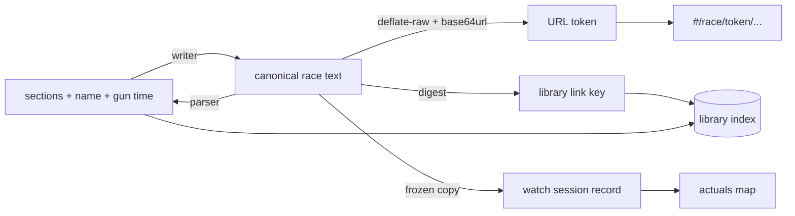
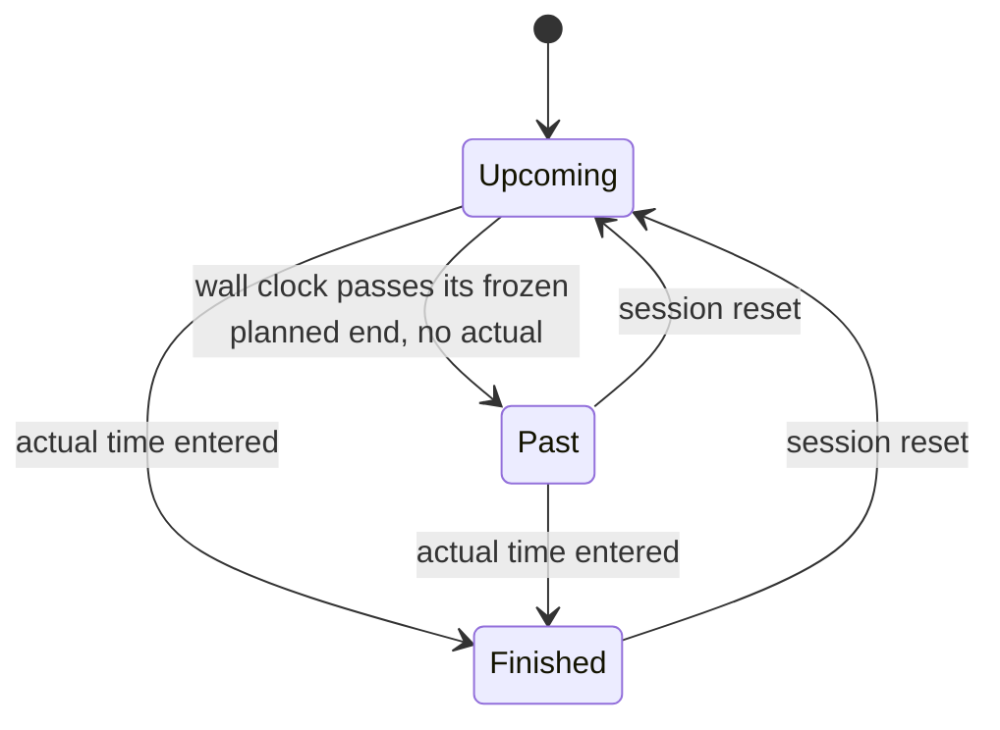
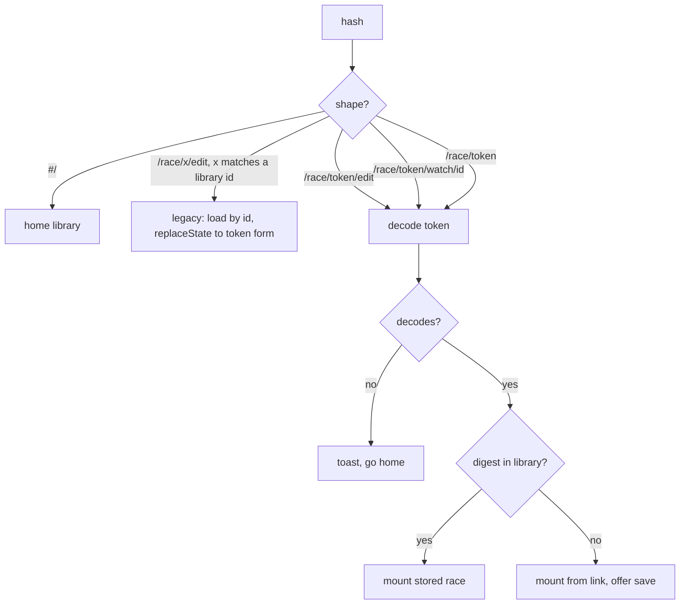

# Race Splits Watch-First Rework - Plan

## Goal Capsule

- **Objective:** On race day, anyone given a single link can open the athlete's race and see where they should be and when to expect them, and whoever is close enough to see the athlete pass can keep their own copy of that picture true by typing in times as checkpoints go by. Each viewer's entered times stay on their own device; a viewer who enters none sees the frozen plan.
- **Means:** Promote Watch Live to the primary action on every surface, make the race URL a self-contained shareable link derived from the race's own text, and record race-day times as an overlay on a frozen plan (KTD3, KTD5).
- **Authority:** R-IDs win on product behavior. KTDs win on mechanism within their cited R constraints. Units override neither.
- **Execution profile:** One file, no build, no dependencies, no test runner. Every unit is verified by opening `index.html` in a browser and walking its scenarios.
- **Stop conditions:** Stop and ask if a race link copied from the published-artifact deployment does not carry the fragment into a second browser — the whole addressing scheme depends on it and it is not yet verified. Stop and ask if dropping per-race metadata would make an already-stored race fail to load. Stop and ask if the sample race's share link cannot be held under the 2,000-character budget.
- **Who finishes:** The implementing agent lands the units; the user verifies in-browser.

---

## Product Contract

### Summary

Rework race-splits so that watching a live race is the app's primary job rather than its read-only afterthought. Watch Live becomes the dominant action on both the home library and the edit page, with the remaining actions collapsed behind a cog menu and an icon row. Per-race metadata — location, date, and leg distances — is removed, so a race is a name, a gun time, and an ordered list of splits that each carry their own distance; leg distances and paces derive from the splits themselves. A single compact text format serves as both import and export, and the race's URL is derived from that text and carries it as an encoded payload, so a copied link opens the same race on any device. Watch mode gains a running elapsed counter, two timeline pins, past and finished states on splits and legs, and a resumable, resettable session in which entering actual times revises the projected finish while the original estimate stays on screen next to it.

### Problem Frame

The app was built for one athlete simulating one race in one browser, and race day is a different job for different people. Staff at a checkpoint and family at home want to know where the athlete is and when to expect them. Today all they get is a marker sliding along a bar computed from a plan that stops being true the moment the athlete is five minutes off it, and nobody can correct it, because follow mode is read-only — not even the person standing at the checkpoint watching the athlete go past. The link they would need is a local storage id, so it means nothing on a device that has never opened the app. And before any pace figure means anything at all, someone has to have filled in a settings dialog with leg distances that the checkpoints themselves already imply. The view meant for race day is the least useful one in the app.

### Key Decisions

- KD1. Location, date, and per-race leg distances are dropped rather than relocated — this is a tool for planning a race and watching it, not a record of races. (session-settled: user-directed — chosen over moving them into the new text format: they are not data the app acts on.) Governs R6, R7.
- KD2. Race-day times are an overlay on a frozen copy of the plan, never an edit to the plan itself, and a plan edit detaches rather than disturbs a running session. (session-settled: user-directed — chosen over letting a session follow later edits: a race in progress must not shift under the person watching it.) Governs R19, R20, R21, R26.
- KD3. A share link carries the race rather than referring to it. (session-settled: user-approved — chosen over an opaque digest resolved against local storage: a digest alone reconstructs nothing on a device that has never seen the race.) Governs R13, R15, R16.
- KD4. The raw race-notes parser is removed outright rather than kept as a fallback input. (session-settled: user-directed — chosen over accepting both formats: two accepted shapes means ambiguity at every line the parser reads.) Governs R9, R11.
- KD5. The plan pin reports where the athlete *should* be at the current wall-clock time, and the actual pin reports where the entered times say they are. (session-settled: user-directed — chosen over a pin marking the revised finish projection: a continuously-moving reference is what makes the ahead/behind gap readable at a glance.) Governs R22.

### Requirements

**Naming and action hierarchy**

- R1. The read-only race view is called "Watch Live" on every human-facing surface that names it — home card, edit masthead, and document title. The word "follow" survives nowhere, the route segment included, where it reads `watch` per R20.
- R2. On the home library, Watch Live is the visually dominant action on a race card, clearly outranking every other control on that card.
- R3. A home card's remaining actions — Edit, Rename, Duplicate, Delete — sit behind one cog control rather than as sibling buttons.
- R4. On the edit page, Watch Live is the primary masthead action.
- R5. On the edit page, Copy and Paste are icon-only controls grouped at the right of the masthead beside the saved indicator.
- R6. A home card shows the race's gun clock time and its projected finish clock time, both subordinate to the existing elapsed finish figure.
- R7. The edit page labels its headline figure "Finish Estimate" and shows the corresponding finish clock time beneath it, subordinate to the elapsed figure.

**Race identity and derived values**

- R8. A race stores a name, a gun time, and an ordered list of sections, and stores no location, date, or per-race leg distances.
- R9. Leg distance, leg pace, and per-checkpoint pace derive from the distances carried on the sections themselves.
- R10. A leg reports a pace only when every distance-bearing section in it carries a distance; otherwise it reports the distance it has and no pace.

**Text format**

- R11. One text format serves as both the Copy export and the Paste import, and every checkpoint line in it carries a distance field — a value, or an explicit marker for a checkpoint whose distance is unknown.
- R12. Transition lines carry no distance.
- R13. Importing into an existing race replaces its name, gun time, and sections while keeping its place in the library.
- R14. Notes and map links are per-device decoration: they survive edits and are excluded from the text format and from the share link.

**Links and sharing**

- R15. A race's URL is derived from its canonical text and carries that text as an encoded payload, so opening the URL on another device reconstructs the race.
- R16. The URL updates in place whenever a change alters the canonical text, without adding a history entry per edit.
- R17. A share control copies the current race URL to the clipboard.
- R18. Opening a race link whose race is not in the local library renders that race from the link and offers to save it through a control that stays on screen for as long as the unsaved race is being viewed, stating plainly that saving adds a new race.
- R19. Existing `#/race/<id>/edit` and `#/race/<id>/follow` bookmarks still resolve, redirecting to the equivalent current URL.

**Watch mode**

- R20. Watch mode runs inside a named session addressed as `#/race/<token>/watch/<watchId>`; the session id is generated on first entry, stored locally, and reachable again by returning to that URL.
- R21. A watch session freezes the plan it started against, so later edits to the race leave a running session unchanged.
- R22. Within a watch session, any checkpoint that does not yet carry an actual time can be given one, whether or not the frozen plan's clock has reached it — an athlete running ahead of plan is recorded as they pass, not once the plan catches up.
- R23. Entering an actual time revises the projected clock time of every remaining checkpoint, the finish included, and the frozen plan's original finish estimate stays visible beside the revised one.
- R24. The timeline carries two pins — where the frozen plan says the athlete should be at the current wall-clock time, and where the entered actual times say they are — and reports the gap between them as ahead or behind.
- R25. Watch mode shows a running elapsed-time counter measured against the gun time.
- R26. A checkpoint carrying an actual time shows that time, visually emphasised, and a leg whose checkpoints all carry actual times is emphasised the same way.
- R27. A checkpoint the race has moved past without an actual time is de-emphasised, as is a leg the race has moved past.
- R28. A watch session can be reset, which clears its actual times and re-freezes it against the race's current plan.

**Interaction details**

- R29. Pressing Enter in any editable field commits the value and leaves the field.
- R30. The pace chip row includes Transitions, occupying less space than the sport chips.
- R31. The position pin reads as a deliberate marker rather than a hairline rule.

### Success Criteria

- A link copied in one browser and opened in another shows the same race, with no prior setup in the second browser.
- Someone watching can enter three checkpoint times during a race and read a revised finish without leaving watch mode.
- The sample race's share URL stays under 2,000 characters.
- Reaching a live race from a cold start is one tap from the home library.

### Acceptance Examples

- AE1. Covers R21, R23. Given a session frozen against a plan finishing at 7:44, when the bike exit is entered six minutes late, then the session shows a revised finish of 7:50 with 7:44 still shown as the original estimate.
- AE2. Covers R21. Given a running watch session, when the race's splits are edited in the edit view, then that session's timeline, pins, and estimates are unchanged.
- AE3. Covers R24. Given actuals through the bike leg putting the athlete six minutes down, when the clock reads mid-run, then the plan pin sits ahead of the actual pin and the gap reads six minutes behind.
- AE4. Covers R18. Given a link to a race this browser has never seen, when it is opened, then the race renders and a save control adds it to the library.
- AE5. Covers R10. Given a bike leg where one of six checkpoints has no distance, then the leg shows the distance of the other five and no km/h figure.
- AE6. Covers R26, R27. Given the wall clock has passed checkpoint three's planned time with no actual entered, then checkpoint three is de-emphasised; when its actual is then entered, it becomes emphasised instead.
- AE7. Covers R16. Given the edit view with a race open, when a split is changed, then the address bar's race token changes and the Back button returns to the previously visited view rather than to the pre-edit URL.
- AE8. Covers R12, R11. Given a race with two transitions, when it is copied and pasted back, then both transitions round-trip with their durations and no distance.

### Scope Boundaries

Everything in the eight request areas is in scope, including the removals they imply: the race details dialog, the per-race distance seeding, and the raw-notes parser all go.

#### Deferred to Follow-Up Work

- Elevation per checkpoint and the elevation profile under the timeline.
- Cut-off times per checkpoint with the margin against each.
- Real measured bike checkpoint distances for the sample race, which are even splits today.

#### Outside this product's identity

- Server-backed sync or shared live state between viewers. The published-artifact `db` capability would provide it but makes the artifact organisation-internal, which kills the public link sharing this plan is built around. A share link therefore carries the plan and never the times a viewer has entered: each watch session's actuals live on the device that typed them, and a second viewer sees the frozen plan until they enter times of their own.
- Accounts, a race database, or results publishing.

### Open Questions

- Whether a watch session should expire on its own. Sessions accumulate one record per watched plan and nothing prunes them. Deferred: not blocking, and the right retention rule is easier to pick once the feature has been used for a race.
- Whether a share link should be offered for a specific watch session rather than only for the plan. Deferred: session ids are local by design in this plan, and sharing one would imply shared state, which is outside scope above.

---

## Planning Contract

### Key Technical Decisions

- KTD1. The canonical text format is a name line, a gun-time line, then one line per checkpoint carrying a sport token, a distance, a split, and a name. Splits rather than clock times are the line's time value, because `dur` is already the model's source of truth, so export needs no reconciliation pass and editing one checkpoint rewrites one line instead of every line after it. Governs R11, R12.
- KTD2. Distances in the text format are kilometres for every sport, swim included, written to up to three decimals. One unit rule removes the per-sport branch from the parser; the UI keeps rendering swim in metres through the existing `SPORTS` unit table. Three decimals is what keeps the round trip lossless — swim distances are stored in whole metres, so the two-decimal precision the display uses would turn a 667 m split into 670 m. Governs R11.
- KTD3. The race URL carries the canonical text as a `deflate-raw`-compressed, base64url-encoded payload in the fragment, and a short digest of that text is the race's link-matching key. `CompressionStream` is Baseline 2023, and the sample race compresses to a few hundred characters against a ~2,000-character shareable budget. Where `CompressionStream` is absent the payload is encoded uncompressed under a distinct prefix byte, so links made there stay correct and merely run longer; the decoder reads the prefix and never needs to guess. This protects link creation only — a compressed link cannot be read without `DecompressionStream`, so that case gets its own message rather than being reported as a corrupt token. (session-settled: user-approved — chosen over an opaque digest resolved against local storage: a digest reconstructs nothing on a device that has never seen the race.) Instantiates KD3. Governs R15, R17, R18.
- KTD4. The library keeps a stable internal race id as its storage key and stores the digest alongside it; the digest addresses a race in a URL but never keys it in storage. Renaming, duplicating, and deleting all need an identity that survives a split edit, which a content digest by definition does not. Governs R16, R19.
- KTD5. A watch session is its own stored record holding the library race id, a frozen copy of the plan text, and a sparse map of actual elapsed times keyed by section index. The race id is what lets reset find the plan to re-freeze against; the frozen text alone cannot, because its digest stops matching the moment the race is edited, which is exactly the case reset exists for. Freezing the plan inside the session is what makes a running session immune to a later edit, and indices are stable because the frozen text never changes. (session-settled: user-directed — chosen over writing actuals onto the race itself.) Instantiates KD2. Governs R20, R21, R22, R28.
- KTD6. URL refreshes are written with `history.replaceState`, which fires no `hashchange` and so causes no remount on its own. The guard the refresh does need is an ordering one: `commit()` runs on every mutation and the encode is async, so the refresh captures the current route and a commit sequence number before awaiting, and discards its result when either has moved on. Without it a repeating arrow-key nudge can land encodes out of order, leaving the address bar — and the share link taken from it — on a superseded plan, and leaving the edit view can stamp the old race's token onto the view the user just opened. `router()` additionally skips work when the incoming hash resolves to the route already mounted. Governs R16.
- KTD7. Encoding and decoding are asynchronous because `CompressionStream` is stream-based, so mounting a race from a link is an async step that must tolerate the user navigating away before it settles. Governs R15, R18.
- KTD8. The `est` flag and the even-split distance seeding it marked are removed along with the per-race distances. With no leg total to divide there is nothing to estimate from, and the new format supplies a real distance per checkpoint. Governs R8, R9.
- KTD9. Notes and map links stay out of the canonical text and therefore out of the share link; the JSON backup remains the full-fidelity copy. A single map URL can consume most of the URL budget on its own, and a note is a private aide-mémoire rather than part of the plan being shared. Governs R14.
- KTD10. A bare `#/race/<token>` resolves to watch mode, resuming this browser's session for that plan or creating one, and the share button copies that bare form. Chosen over defaulting a bare token to edit: a shared link is overwhelmingly opened to watch, and someone who wants to edit a race they received can reach it from the library once they save it.  Governs R20.

A bake-off was considered for the link mechanism and the overlay data shape, the two places where a wrong choice would be expensive to unwind. Neither qualified: both forks were surfaced and settled in the planning conversation, so there was nothing left to develop before choosing.

### Assumptions

- "Except for the T1" is read as *transitions carry no distance*, not as a rule about the first transition specifically. Transitions already have no distance unit in the model.
- "Section" in the greying and highlighting requirements is read as the leg card — the swim, bike, run, or transition group — since "split" already names the row.
- The masthead's distance line stays, now rendering per-leg totals derived from the sections instead of the stored per-race figures.
- Migrating an existing stored race strips the removed fields and keeps its sections untouched. Its per-section distances survive, so a legacy race keeps its paces **only where every section in a leg carries one**. A checkpoint that was reordered or added under the current version has no distance, so under R10 its whole leg now withholds its pace and its masthead distance shrinks. That is a visible change to existing data, not a regression.
- No test harness is added. Verification is manual in-browser against the enumerated scenarios (user-directed; the app is not expected to grow much beyond this).

### Implementation Constraints

- `index.html` stays one self-contained file with no build step and no dependencies. It is deployed as a published Claude artifact, whose hosting requires a single document.
- **Unverified prerequisite:** whether a fragment the page writes survives into a link a person can copy and send from that published-artifact deployment. The app runs there inside a sandboxed frame, so the URL the page controls is not necessarily the URL anyone would share, and hash routing working today is no evidence either way — today's routes never have to leave that frame. Everything from U3 onward rests on this. U3 gates on it.
- The script's banner-comment sections are in dependency order, and new code belongs in the section that owns its concern rather than appended at the end.
- The only permitted external request remains the Archivo webfont.

### High-Level Technical Design

The canonical text becomes the hub the rest of the system hangs off. It is what Copy emits, what Paste consumes, what the URL carries, what the digest is taken over, and what a watch session freezes.



Format grammar, directional:

```text
race      := nameLine gunLine entry+
nameLine  := <free text, never blank — "Untitled race" stands in for an unnamed race>
gunLine   := <clock, h:mm or h:mm:ss>
entry     := sport SP dist SP split SP name     ; sport is S | B | R
           | "T"   SP split SP name             ; transition, no distance
dist      := <kilometres, up to 3 decimals> | "-"   ; "-" is a checkpoint carrying no distance
split     := [h:]mm:ss
```

Blank lines are skipped. Line order is the section order, and consecutive lines sharing a sport form a leg, which is how `groups()` already derives legs today.

A checkpoint in watch mode is in exactly one of three display states, and a leg takes the state of its checkpoints:



Route resolution has to tell four shapes apart and decode before it can mount:



### Sequencing

Five phases. The model and format changes come first because the URL is derived from the format and the watch session freezes it, so every later phase reads from what phase A establishes. After phase B the tree branches rather than chains — the Unit Index dependencies are authoritative, and phases C and D both hang off B independently.

Watch comes before the surface work even though neither depends on the other. Stopping after phase C would leave an app that *looks* watch-first — Watch Live promoted, actions tucked behind a cog — while still unable to do the job the whole rework exists for. Building watch first also means the home card's one-tap-to-watch check is walked against a real watch view rather than a placeholder.

| Phase | Units | Theme |
|---|---|---|
| A | U1, U2 | Model and canonical text |
| B | U3, U4 | Addressing and sharing |
| C | U7, U8, U9 | Watch sessions and surface |
| D | U5, U6 | Home and edit surfaces |
| E | U10 | Global interaction pass |

---

## System-Wide Impact

The change is not localized: it alters the persisted data shape, adds a second persisted entity, and rewrites the addressing contract every view depends on.

- **Persistence shape.** Every stored race loses three fields and every stored section loses one. `normalize()` is the single read-side gate for this, so the migration is safe only if it stays the only place a race enters memory. The removal is one-way — a downgrade to the current version would read races with no `dist` and fall back to its per-sport defaults, silently reporting wrong leg distances rather than failing.
- **A second persisted entity.** Watch sessions are the first record in the app whose lifetime is not tied to a race. Nothing deletes them: deleting a race leaves its sessions orphaned, and each watched plan adds one. The plan accepts this and records the retention question under Open Questions; the risk below bounds it.
- **Route and link contract.** Every route changes shape, and the URL becomes long enough to matter. Existing bookmarks are the compatibility surface (R19), and the redirect is the only thing standing between a saved `#/race/<id>/edit` link and a toast to home.
- **Async mounting.** Mounting becomes asynchronous for the first time (KTD7). The router's existing invariant — one mount owns `active`, and `teardownActiveView()` clears the previous one — now has a window in which a decode for a route the user already left can resolve. Every mount path must re-check that its route is still current before writing `active`.
- **Undo and focus.** `commit()` gains a URL write (KTD6). `commit()` is called by every mutation including per-keystroke-commit field edits, so a mistake here degrades typing across the whole edit view rather than in one field.
- **Accessibility.** Two controls lose their text labels (R5) and one gains a menu (R3), so the icon-only controls need accessible names and the cog menu needs keyboard operation and focus return. Watch mode gains a second pin on a surface whose live-region discipline already exists and must not regress into per-tick announcements.

---

## Risks & Dependencies

| Risk | Mitigation |
|---|---|
| `CompressionStream` absent on an older browser | The prefixed uncompressed fallback (KTD3) protects link *creation* on that browser only. It cannot rescue *reading* a compressed link made elsewhere, so that browser gets a distinct "this link needs a newer browser" message rather than the corrupted-token one |
| A large race exceeds the shareable URL budget, producing a link that works in one client and truncates in another | Warn at share time and offer the canonical text instead (U4). Never hand back a link that was silently cut |
| The migration runs against a race it misreads, losing sections | The migration only strips fields and never rewrites `sections`; it is gated on its own sentinel so it cannot run twice. Verify against a profile holding a current-version race before the read path changes |
| Watch sessions accumulate without bound and exhaust the storage quota | Sessions are small (frozen text plus a sparse map). Storage refusal already surfaces loudly through `storageOK` and the sync indicator rather than failing silently. Retention rule deferred under Open Questions |
| A decode resolving after the user navigated away mounts a stale race | Re-check the current route before writing `active` in every async mount path (System-Wide Impact) |
| A repeating edit lands its async encodes out of order, leaving the address bar — and a share link taken from it — on a superseded plan | The ordering guard in KTD6: capture the route and a commit sequence number before awaiting the encode, discard a result that is no longer current |
| Clipboard unavailable, so share appears to do nothing | Reuse the existing textarea-select fallback already used by Copy (U4) |
| A downgrade after migration reports wrong leg distances instead of failing | Accepted, not mitigated. Noted here so it is a known consequence rather than a surprise |

**Dependencies:** none external. No new library, no build step, no network call beyond the existing webfont. The only platform dependency is `CompressionStream`/`DecompressionStream`. The fallback above keeps link creation working without it; reading a compressed link genuinely requires it, and that case is reported rather than silently failing.

---

## Implementation Units

### Unit Index

| U-ID | Title | Primary files | Depends on |
|---|---|---|---|
| U1 | Drop per-race metadata, derive legs from sections | `index.html` (Model, Derived, Render) | — |
| U2 | Canonical race text: writer and parser | `index.html` (Importer, Wiring) | U1 |
| U3 | Content-addressed race links and router rework | `index.html` (Model, Router) | U2 |
| U4 | Share control and library index fields | `index.html` (Model, Wiring) | U3 |
| U5 | Home library: Watch Live first, cog menu, clock times | `index.html` (Router/views, styles) | U4 |
| U6 | Edit masthead: action hierarchy and finish estimate | `index.html` (body, Render, styles) | U4 |
| U7 | Watch sessions: route, frozen plan, reset | `index.html` (Model, Router) | U3 |
| U8 | Watch actuals: entry, revised projection, past and finished states | `index.html` (Derived, Render, styles) | U7 |
| U9 | Watch timeline: dual pins and elapsed counter | `index.html` (Router/views, styles) | U8 |
| U10 | Global interaction pass: Enter-to-commit, Transitions chip | `index.html` (Render) | U6 |

### U1. Drop per-race metadata, derive legs from sections

- **Goal:** A race is a name, a gun time, and sections; every distance and pace figure in the app comes from the sections.
- **Requirements:** R8, R9, R10.
- **Dependencies:** none.
- **Files:** `index.html` (sections 1 Model, 3 Derived, 5 Render), `README.md`.
- **Approach:**
  1. Remove `location`, `date`, and `dist` from the race shape, from `normalize`, `createRace`, `duplicateRace`, and `indexEntry`; delete `normDist`, `defaultDist`, and the `official` field on `SPORTS`.
  2. Delete the race details dialog markup, its button, and its handlers; delete `fmtDate` and `MONTHS` with their last caller.
  3. Drop `est` from the section shape and from every render path per KTD8, and remove the even-split seeding block in the importer's section builder.
  4. Rework `renderMasthead` to build its distance line from `legTotals()` rather than the stored per-race figures.
  5. Add the pace-completeness rule from R10 to `legTotals` and `paceOf`'s callers: a leg missing a distance on any distance-bearing section reports no pace.
  6. Add a one-time migration that strips the removed fields from stored races, gated on its own sentinel key alongside the existing `race-splits:migrated`.
- **Execution note:** Seed a browser profile with a race saved by the current version *before* touching the read path — including one checkpoint moved, so a cleared distance is present — and keep it as the reference throughout. A pristine sample race carries every distance, so the pace-withholding change never appears in verification and lands unexplained on the user's own data. The migration is one-way (System-Wide Impact), so a read-path mistake is only visible against real prior data.
- **Patterns to follow:** `normalize()`'s field-by-field validation shape; the existing `migrateLegacy()` sentinel gating.
- **Test scenarios:**
  - A race stored by the current version loads after the change with its sections and per-section distances intact and no console error.
  - A race containing a checkpoint that was moved under the current version — so its distance is already cleared — shows that leg's distance without a pace, rather than silently reporting a wrong one.
  - A race stored by the current version loads with its location, date, and leg distances gone from the blob after one save.
  - A bike leg where every checkpoint carries a distance shows a km/h figure.
  - A bike leg where one checkpoint's distance is cleared shows the remaining distance and no km/h figure.
  - A race consisting only of transitions renders without a pace chip and without a divide-by-zero artifact.
  - The masthead distance line matches the sum of section distances per sport.
- **Verification:** No reference to `location`, `date`, `dist`, `est`, or `official` survives in the source; a legacy race opens and shows the same leg totals it showed before.

### U2. Canonical race text: writer and parser

- **Goal:** One text format that Copy emits and Paste consumes, round-tripping a race exactly.
- **Requirements:** R11, R12, R13, R14.
- **Dependencies:** U1.
- **Files:** `index.html` (sections 7 Importer, 8 Wiring), `data/fodaxman-sp5-2025.txt`, `README.md`.
- **Approach:**
  1. Write the serializer against the grammar in the High-Level Technical Design, emitting kilometres per KTD2 and omitting notes and map links per KTD9.
  2. Replace `parseRaw` and `buildSections` with a single-pass line parser for that grammar; delete `HEADERS`, `HINTS`, `IS_START`, `RE_TIME`, and `guess` per KD4.
  3. Point `#btn-copy` at the serializer instead of the tab-separated table, and keep the JSON backup path on `#dlg-backup` unchanged.
  4. Keep the dialog's live preview and warning behavior, re-pointing both at the new parser.
  5. Rewrite `data/fodaxman-sp5-2025.txt` in the new format, carrying the real per-checkpoint distances the file's note discusses where they are known and even splits where they are not.
- **Patterns to follow:** the existing preview-then-commit flow in the paste dialog; `tryRestoreBackup`'s "starts with `{`" discrimination, which still routes JSON backups.
- **Test scenarios:**
  - Copying the sample race and pasting the result back produces an identical section list, gun time, and name.
  - Pasting text whose first checkpoint line carries a malformed distance surfaces a parse warning naming the line and commits nothing.
  - A checkpoint whose distance was cleared by a drag round-trips through the no-distance marker and comes back with no distance rather than zero.
  - A swim checkpoint of 667 m round-trips to 667 m rather than 670 m.
  - A transition line with a distance in it is rejected with a warning rather than silently parsed.
  - Pasting a JSON backup still restores notes and map links.
  - Pasting into an existing race replaces its name, gun time, and sections and leaves it in the same position in the library.
  - Pasting text with blank lines between legs parses the same as text without them.
  - A race with a note and a map link, copied and pasted back, loses the note and map link and keeps everything else, matching KTD9.
- **Verification:** The rewritten `data/fodaxman-sp5-2025.txt` pastes cleanly and reproduces the 7:44 finish.

### U3. Content-addressed race links and router rework

- **Goal:** A race's URL carries the race, updates as the splits change, and old bookmarks still land somewhere sensible.
- **Requirements:** R15, R16, R18, R19.
- **Dependencies:** U2.
- **Files:** `index.html` (sections 1 Model, 9 Router).
- **Approach:**
  1. **Gate first:** publish the artifact, copy a race link from inside it, and confirm it opens the same race in a second browser. If the copied link does not carry the fragment, stop — the rest of U3, and everything after it, rest on it.
  2. Add encode and decode helpers over `CompressionStream`/`DecompressionStream` with base64url, plus a short digest over the canonical text, per KTD3 and KTD7.
  3. Rework `parseHash` for the four shapes in the route-resolution flowchart, including the bare-token default to watch from KTD10. A legacy id and a token are the same URL shape — the existing seven-character id is itself valid base64url — so `/race/<x>/edit` resolves `<x>` against the library index as a race id first and takes the legacy path on a hit, decoding it as a token only when no index entry matches.
  4. Make mounting async: decode, then resolve against the library by digest, then mount either the stored race or a transient one carrying a save control per R18. The control is a persistent strip in the masthead, not a toast — the toast auto-hides after seven seconds even with an action attached, and someone orienting on a page they have never seen would lose their one chance to save. A digest matching more than one stored race resolves to the most recently saved.
  5. Add the ordering guard from KTD6 and call the refresh from `commit()` so every mutation refreshes the token in place.
  6. Resolve a legacy `#/race/<id>/edit` or `/follow` hash by loading from storage by id and replacing the URL with the token form.
- **Execution note:** Prove link portability in the real deployment before building anything on top of it — see the Goal Capsule stop condition. After that, land the ordering guard from KTD6 before wiring the URL write into `commit()`; `commit()` runs on every mutation, so an unguarded refresh misbehaves everywhere at once and is easy to mistake for an unrelated focus bug. Keep the typing scenario as a regression check on `commit()` rather than as proof of the guard.
- **Patterns to follow:** the existing `router()` / `teardownActiveView()` / mount split; the unknown-route toast-and-redirect behavior already used for a deleted race.
- **Test scenarios:**
  - Editing a split changes the token in the address bar and leaves the Back button pointing at the previously visited view, not the pre-edit URL.
  - Typing in a split field and letting it commit does not blur the field or clear the undo stack.
  - A token copied from one browser profile and opened in another renders the same race.
  - A truncated or corrupted token shows a toast and lands on home rather than throwing.
  - Reopening a link taken before an edit offers to save and says it will add a new race, rather than silently creating a second copy of the same race.
  - Two library races holding identical text resolve to the most recently saved rather than whichever matches first.
  - The save control on an unsaved shared race is still reachable a minute after the page loads.
  - A legacy `#/race/<id>/edit` bookmark for a race still in storage opens that race and rewrites the URL to the token form.
  - A legacy bookmark for a deleted race toasts and lands on home.
  - Navigating away while a decode is still in flight does not mount the stale race over the new view.
  - With both streams stubbed out, a link still encodes and decodes through the uncompressed path and renders the same race.
  - Opening a compressed link with `DecompressionStream` stubbed out reports that the link needs a newer browser, distinctly from the corrupted-token path.
  - The sample race's full URL is under 2,000 characters.
- **Verification:** Every route in the flowchart resolves to the view it names, and the address bar token changes on each split edit.

### U4. Share control and library index fields

- **Goal:** One control copies a working link, and the home library can render a card without decoding anything.
- **Requirements:** R6, R17.
- **Dependencies:** U3.
- **Files:** `index.html` (sections 1 Model, 8 Wiring).
- **Approach:**
  1. Extend the index entry written by `saveRace` with the digest, the finish total, and the gun time, so `renderHome` stops loading every race blob to compute a finish. Backfill all three for every existing entry in one sentinel-gated pass when this unit lands, in the shape U1's migration already uses — waiting for each race's next save would leave cards showing em dashes and would stop an incoming link matching a race already saved.
  2. Home cards address their race by internal id through the existing delegated `[data-act]` handler rather than by href: a token is the compressed text, so building one per card would need every race blob and an async encode. The router encodes the token and replaces the URL at mount.
  3. Add the share control, copying the bare `#/race/<token>` form per KTD10, with the existing clipboard-failure fallback.
  4. Warn rather than silently copy when the composed URL exceeds the shareable budget, offering the canonical text instead.
- **Patterns to follow:** `#btn-copy`'s `navigator.clipboard` call with its textarea fallback; `indexEntry`'s shape and the `saveRace` upsert.
- **Test scenarios:**
  - Share copies a URL that, pasted into a fresh browser profile, opens the same race.
  - Share in a context where the clipboard is unavailable falls back to a selectable copy rather than failing silently.
  - A race large enough to exceed the URL budget produces a warning and offers the text instead of a broken link.
  - A race saved before this unit shows its finish and clock times on the home card immediately after the upgrade, with no edit needed.
  - Opening a link to a race that is already saved matches the existing entry rather than offering to save a second copy.
  - Home cards render and dispatch correctly with no async work per card.
- **Verification:** the index alone supplies everything a card renders, and a shared link round-trips between two browser profiles.

### U5. Home library: Watch Live first, cog menu, clock times

- **Goal:** The home card leads with Watch Live and keeps everything else out of the way.
- **Requirements:** R1, R2, R3, R6.
- **Dependencies:** U4.
- **Files:** `index.html` (section 9 Router/views, style block).
- **Approach:**
  1. Rebuild the race card so Watch Live is the dominant control by size and weight, and rename the old Follow action to it per R1.
  2. Move Edit — the renamed Open — together with Rename, Duplicate, and Delete behind one cog control, built from the existing delegated `[data-act]` handler so no per-card listeners appear.
  3. Add the gun clock time and the projected finish clock time to the card's meta line, subordinate to the existing elapsed finish figure.
  4. Give the menu keyboard access and a click-outside close, and make sure it does not trap focus.
- **Patterns to follow:** the single delegated `#home-view` click handler, which survives every `renderHome()` rebuild; `.btn.primary` and `.btn.ghost` as the existing weight vocabulary.
- **Test scenarios:**
  - Watch Live on a card opens that race's watch view in one tap.
  - The cog opens a menu containing exactly Edit, Rename, Duplicate, and Delete.
  - Escape closes the menu and returns focus to the cog.
  - A click elsewhere on the page closes an open menu.
  - Deleting a race from the menu still offers the undo toast and restores on undo.
  - A race with no splits shows an em dash for both clock figures rather than a nonsense time.
  - At 400px width the card's actions stay on screen without horizontal scroll.
- **Verification:** Every action previously on the card is reachable, and Watch Live is the only control at primary weight.

### U6. Edit masthead: action hierarchy and finish estimate

- **Goal:** The edit page points at Watch Live and demotes its utilities to icons.
- **Requirements:** R4, R5, R7.
- **Dependencies:** U4.
- **Files:** `index.html` (body masthead, section 5 Render, style block).
- **Approach:**
  1. Promote `#watch-live` to the primary masthead action and demote the rest.
  2. Convert Copy and Paste to icon-only controls grouped at the right with `#sync`, each carrying an accessible label and a tooltip; the details button is already gone with U1.
  3. Relabel the board's headline to "Finish Estimate" and add the finish clock time beneath it at lower visual weight.
  4. Place the share control from U4 in the masthead alongside the icon group.
- **Patterns to follow:** the existing `.icon` button class used by the map pin and delete controls; the `#race-view.readonly` display rules that hide edit-only chrome.
- **Test scenarios:**
  - The masthead's only primary-weight control is Watch Live.
  - Copy and Paste expose their names to assistive technology despite showing no text.
  - The finish clock figure equals gun time plus the elapsed finish, wrapping correctly past midnight.
  - A race with no splits shows an em dash for both finish figures.
  - At 400px width the masthead wraps without overlapping the saved indicator.
- **Verification:** Keyboard tab order reaches every masthead control, and the finish clock tracks the elapsed finish as splits change.

### U7. Watch sessions: route, frozen plan, reset

- **Goal:** Watching a race happens inside a session that owns its own frozen copy of the plan.
- **Requirements:** R20, R21, R28.
- **Dependencies:** U3.
- **Files:** `index.html` (section 1 Model, section 9 Router).
- **Approach:**
  1. Add the session record from KTD5 — library race id, frozen plan text, sparse actuals map, created timestamp — under its own storage key prefix, with a validating read in the shape `normalize` uses.
  2. Resolve `#/race/<token>/watch/<watchId>` to that session; resolve a bare token by finding this browser's most recent session for that plan's digest, or creating one.
  3. Mount watch from the session's frozen text rather than from the stored race, which is what makes AE2 hold.
  4. Add reset: clear the actuals and re-freeze from the session's race id immediately — keeping the existing frozen text when that id is not in the library, which is how a session started from someone else's link behaves — offering recovery through the toast's Undo action. This is the pattern every other destructive action here already uses — deleting a race, removing a section, moving one — so reset does not need a heavier gate than deleting an entire race has.
  5. Rename the `follow` route, mode, and document title to `watch` per R1, keeping the legacy redirect from U3.
- **Execution note:** Prove the detach property (AE2) as soon as the session record reads and writes, before building any of the watch surface on top of it. Detachment is the property the whole phase rests on, and it is cheapest to verify against a bare session.
- **Patterns to follow:** the per-race blob plus index storage split; `teardownActiveView()` as the single place view timers are cleared.
- **Test scenarios:**
  - Entering watch from a card creates a session and puts its id in the URL.
  - Leaving watch and returning to the same URL resumes the same session with its actuals intact.
  - Editing the race's splits while a session exists leaves that session's frozen plan and finish estimate unchanged.
  - Reset clears the actuals and re-freezes against the edited plan, so the session then reflects the edit.
  - A watch URL naming a session id this browser does not have toasts and falls back to a new session for that plan.
  - A session whose stored record is corrupt is discarded rather than mounted.
- **Verification:** AE2 holds — a split edit during a running session changes nothing in that session until it is reset.

### U8. Watch actuals: entry, revised projection, past and finished states

- **Goal:** Times entered during the race revise the finish without losing the original estimate, and every split and leg shows which state it is in.
- **Requirements:** R22, R23, R26, R27.
- **Dependencies:** U7.
- **Files:** `index.html` (section 3 Derived, section 5 Render, style block).
- **Approach:**
  1. Make watch rows editable for their actual time only, writing into the session's actuals map and leaving the frozen plan untouched per KD2. An actual is typed as a **clock time** in the row's Clock cell — that is what a volunteer reads off a watch — and converted to elapsed with the same day-wrapping the live marker already performs. The existing elapsed-edit path clamps a negative value to zero, so a checkpoint after midnight would otherwise record as zero and destroy the projection for exactly the night races the piecewise marker exists to handle.
  2. Derive the revised projection from the latest checkpoint carrying an actual: elapsed to there, plus the frozen plan's remaining durations.
  3. Render both finishes together — the frozen original and the revision — with the original clearly labelled as the plan, and show each upcoming row's revised clock beside its frozen one. Staff waiting at a checkpoint care about their own arrival time, not the finish line, and the same elapsed-plus-remaining derivation already gives every intermediate checkpoint.
  4. Apply the three display states from the state diagram to rows, and roll them up to leg cards: a leg is finished when all of its checkpoints have actuals, past when the wall clock is beyond its frozen end.
  5. Keep the existing read-only treatment for every other field, so the only writable thing in watch mode is an actual time.
- **Patterns to follow:** `timeField` / `staticText` as the editable-versus-static pair; the `readOnly` flag that already gates every render path.
- **Test scenarios:**
  - Entering an actual six minutes late for the bike exit revises the finish by six minutes and leaves the original finish on screen (AE1).
  - Entering an actual for a checkpoint with earlier checkpoints still blank projects from that checkpoint rather than treating the blanks as zero.
  - Clearing an actual returns the projection to the state implied by the remaining actuals.
  - A six-minute-late actual shifts every later checkpoint's projected clock by six minutes, not only the finish.
  - Entering an actual earlier than the previous checkpoint's actual is rejected with a visible reason rather than producing a negative split.
  - Entering an actual for a checkpoint falling after midnight records the correct elapsed rather than clamping to zero.
  - Entering an actual for a checkpoint the plan's clock has not yet reached is accepted, so an athlete ahead of plan is recorded as they pass (R22).
  - A checkpoint whose planned time has passed with no actual is de-emphasised; entering its actual emphasises it instead (AE6).
  - A leg becomes emphasised only once all of its checkpoints carry actuals.
  - Nothing in watch mode writes to the race blob — the race's saved timestamp is unchanged after entering actuals.
- **Verification:** AE1 and AE6 hold, and the stored race is byte-identical before and after a watch session enters actuals.

### U9. Watch timeline: dual pins and elapsed counter

- **Goal:** The timeline shows where the athlete should be, where they are, and how long they have been racing.
- **Requirements:** R24, R25, R31.
- **Dependencies:** U8.
- **Files:** `index.html` (section 9 live marker, style block).
- **Approach:**
  1. Rework the single marker into two pins — the plan pin driven by wall clock against the frozen plan per KD5, and the actual pin derived from the entered actuals advanced to now. Tell them apart with the hollow-versus-filled idiom the map-pin icons already establish for unset versus set: outline for the projected plan position, filled for the position the entered times give. That reuses visual language already in the file rather than inventing a second one, and it survives both themes and direct sunlight better than a colour-only distinction.
  2. Keep the existing piecewise before-gun and after-finish placement for both pins rather than a single elapsed-over-total ratio.
  3. Report the gap as ahead or behind, computed from unclamped elapsed values — wall-clock elapsed minus the actuals-derived elapsed — while pin *placement* stays clamped to the ends of the bar. Reading the gap off the clamped positions would shrink it toward zero once the wall clock passes the frozen finish, which is precisely when a late athlete makes the number matter. Suppress the actual pin entirely until an actual exists.
  4. Add the elapsed counter against the gun time, showing a countdown before the gun and the final elapsed after the finish.
  5. Give the pins real presence per R31, and keep the announcement discipline: pins stay `aria-hidden` and only a phase or segment change updates the polite live region.
- **Patterns to follow:** `paintMarker()`'s piecewise day-wrap handling, which is the reason the current marker survives a race that crosses midnight; the `prefers-reduced-motion` single-paint path and the `stopMarker()` teardown.
- **Test scenarios:**
  - With actuals putting the athlete six minutes down, the plan pin sits ahead of the actual pin and the gap reads six minutes behind (AE3).
  - With no actuals entered, only the plan pin is drawn.
  - Before the gun, both the counter and the pins show the not-started state rather than snapping to the finish.
  - After the frozen finish time, the pins hold at the end and the counter shows the final elapsed.
  - An athlete still on course six minutes after the frozen finish still reads six minutes behind, not zero.
  - A race whose window crosses midnight places both pins correctly rather than wrapping to the far end.
  - Under `prefers-reduced-motion` the view paints once and starts no interval.
  - Navigating away from watch clears the tick, verifiable by the counter no longer advancing in the background.
  - The live region announces on a segment change and not on every tick.
- **Verification:** AE3 holds, and no timer survives navigation away from the watch view.

### U10. Global interaction pass: Enter-to-commit, Transitions chip

- **Goal:** Enter behaves like save everywhere, and transitions appear in the pace row.
- **Requirements:** R29, R30.
- **Dependencies:** U6.
- **Files:** `index.html` (section 5 Render).
- **Approach:**
  1. Add Enter-to-blur to `textField`, `distField`, and `timeField`, alongside the Escape-to-revert that `timeField` already has, so the commit path stays the existing `change` handler.
  2. Add a transitions chip to the chip row, rendering total time and no pace, at reduced width relative to the sport chips.
- **Patterns to follow:** `timeField`'s existing keydown handler, which already intercepts arrows and Escape; the `ORDER`-driven chip loop in `renderBoard`.
- **Test scenarios:**
  - Enter in a split field commits the value, leaves the field, and saves once rather than twice.
  - Enter in a checkpoint name field commits and leaves the field.
  - Enter in the race name, which is a contenteditable rather than an input, keeps its existing commit-and-blur behavior.
  - Escape in a time field still reverts and leaves without saving.
  - A race with two transitions shows one transitions chip carrying their combined time and no pace figure.
  - A race with no transitions shows no transitions chip.
- **Verification:** Every editable field commits on Enter, and the chip row renders transitions last and narrower.

---

## Verification Contract

There is no test runner, build, or lint step in this repo, and none is added (Assumptions). Verification is manual and in-browser.

| Gate | How | Applies to |
|---|---|---|
| App loads | Open `index.html` directly, and again from `python3 -m http.server`, with the console open and clean | All units |
| Sample race round-trips | Paste `data/fodaxman-sp5-2025.txt`, confirm the 7:44 finish, Copy, paste the result back, confirm an identical race | U2 |
| Link portability | Share from one browser profile, open in a second profile with no prior storage | U3, U4 |
| Legacy data survives | Load a profile holding a race saved by the current version; confirm it opens with its sections and distances intact | U1, U3 |
| Session isolation | Start a watch session, edit the race's splits in another tab, confirm the session is unchanged | U7 |
| Race-day walkthrough | Enter three actuals in sequence, confirm the revised finish, both pins, and the past/finished states | U8, U9 |
| Narrow viewport | Repeat the home, edit and watch walkthroughs at 400px | U1, U5, U6, U8, U9, U10 |
| Reduced motion | Repeat the watch walkthrough with `prefers-reduced-motion` forced on | U9 |
| Encoder fallback | Stub `CompressionStream` off and repeat the link-portability check | U3 |
| Keyboard and labels | Tab through home and edit; confirm the cog menu operates from the keyboard and the icon-only controls announce their names | U5, U6 |

Each unit's own scenarios above are the detailed pass; this table is the cross-cutting sweep to run before calling the plan done.

---

## Definition of Done

**Global**

- Every requirement R1 through R31 is either implemented or explicitly listed as deferred with a reason.
- Every acceptance example AE1 through AE8 has been walked in a browser and holds.
- The Verification Contract table passes end to end.
- `README.md` describes the current app: the new text format, the link scheme, watch sessions, and the removal of race details. Its "Not done yet" list reflects the deferrals in Scope Boundaries.
- `data/fodaxman-sp5-2025.txt` is in the new format and imports cleanly.
- Dead code from removed features is gone rather than commented out: the details dialog, `normDist`, `defaultDist`, `fmtDate`, `MONTHS`, `est`, `official`, and the raw-notes parser's regex tables and helpers.
- Any experimental or dead-end code from approaches that did not pan out is removed from the diff.
- `index.html` remains one self-contained file with no build step and no new dependency.

**Per unit**

Each unit is done when its own Verification line holds and its test scenarios have been walked in a browser. A unit that touches a render path is not done until it has been checked at 400px as well.

---

## Sources & Research

- `index.html` — the whole app: model and storage (section 1), time parsing (2), derived values (3), the two editing rules (4), render (5), map links (6), importer (7), wiring (8), router and views (9). Section boundaries are the banner comments; new code belongs in the section owning its concern.
- `README.md` — the current data model, the two editing rules, the follow-mode marker's piecewise placement and why a single ratio fails past midnight, the storage split, and the standing reason server sync is rejected.
- `data/fodaxman-sp5-2025.txt` — the sample race in the old raw-notes format, including the note on which recorded values are authoritative where the clock times and parenthetical elapsed values disagree.
- `docs/plans/2026-09-18-001-feat-multi-race-app-plan.md` and its review findings — the prior multi-race rework, whose F-numbered findings are cited in comments throughout the current source.
- [Compression Streams are supported on all browsers](https://web.dev/blog/compressionstreams) and [caniuse: CompressionStream deflate-raw](https://caniuse.com/mdn-api_compressionstream_compressionstream_deflate-raw) — Baseline 2023, Chrome 80 / Firefox 113 / Safari 16.4. Shapes KTD3 and KTD7.
- [URL length limits by browser](https://urlencodedecode.com/blog/url-length-limits-by-browser.html) — ~2,000 characters is the safe cross-system budget. Shapes KTD3, the R17 warning path, and the third success criterion.
